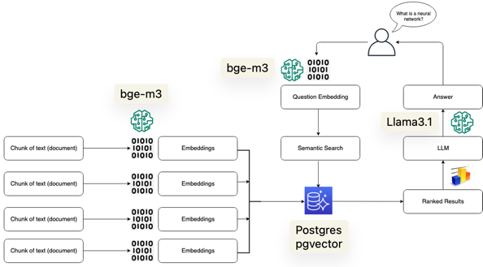

# RAG Demo
This is a demo of RAG (Retrieval Augmented Generation), a model that combines a retriever with a generator. The retriever is used to retrieve relevant knowledge base (KB) from the Vector Database added directly from the interface and then fed to the generator to generate the answer.

This project uses BGE-M3 and Llama3.1 AI models to run the RAG model served by [Ollama](https://ollama.com/)



## How to run
```shell
git clone https://github.com/EthanITA/RAG.git
cd RAG
docker compose up --build -d
# Wait for the containers to pulls the AI models
```
Visit `http://localhost:8080`

## What's happening
All the necessaries requirements to run the project are already satisfied by the compose.yml thanks to Docker:
* Frontend + Backend (Nuxt.js + SSR)
* Database + migrations (PostgreSQL + pgvector + Drizzle ORM)
* AI models (Llama3.1 + bge-m3) by using Ollama

The following volumes will be created:
* `rag_demo_postgres-data` for the PostgreSQL database
* `rag_demo_ollama-data` for the Ollama AI models

### ! Important notes !

It's important to have a good internet connection and enough resource to run the models, make sure to give enough resources to the Docker daemon:
* Llama3.1 requires at least 10.8GB RAM
* Models needs at least 6GB of Disk space to be pulled, not considering the space needed for other images

Recommended resources:
* 11GB RAM
* 16GB Free disk space

Inference may be slow due to CPU-only inference
